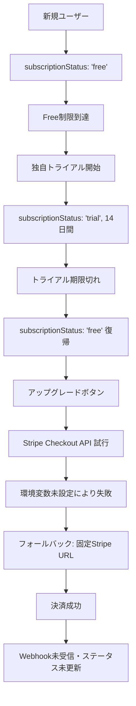

# ConsensusAI 決済・トライアル実装 - 正確な分析と対応方針

**作成日**: 2025-07-26 (修正版)  
**調査方法**: ハルシネーション回避・コードベース直接調査  
**問題**: 決済成功時にユーザーステータス更新されない + Stripeトライアル機能検討  

---

## ❌ **前回分析の重大な誤り**

私の前回分析では「**Stripeトライアル機能が実装済み**」と誤って記載しましたが、これは**完全に間違い**でした。ユーザーの認識が正しく、Stripeトライアル機能は未実装です。

---

## 🔍 **正確な実装状況（コードベース調査結果）**

### ✅ **実装済み：独自トライアル管理**

**実装場所**: `server/src/services/trialService.ts`
```typescript
// 完全実装済みの独自トライアル機能
export class TrialService {
  // ✅ 14日間のトライアル管理
  static async startTrial(userId: string)
  
  // ✅ アプリケーション側での期限管理
  static getTrialStatus(userId: string)
  
  // ✅ データベース管理（SQLite + Firebase）
  static async updateSubscriptionStatus(userId, status, stripeCustomerId)
}
```

**データベーススキーマ**:
```sql
-- 独自トライアル用フィールド（Prisma schema）
model User {
  subscriptionStatus  String?   @default("free")  // 'free' | 'trial' | 'pro'
  trialStartDate      DateTime?
  trialEndDate        DateTime?
  stripeCustomerId    String?   // Stripe連携用（現在ほぼ未使用）
}

model TrialHistory {
  id          String   @id @default(cuid())
  userId      String
  startDate   DateTime
  endDate     DateTime 
  status      String   @default("active")
  trialType   String   @default("standard")
}
```

### ✅ **実装済み：Stripe決済基盤**

**実装場所**: `server/src/services/stripeService.ts` + `routes/billing.ts`

**現在のStripe実装**:
```typescript
// Checkout セッション作成（トライアル期間なし）
const session = await this.stripe.checkout.sessions.create({
  customer: stripeCustomer.id,
  payment_method_types: ['card'],
  line_items: [{ price: priceId, quantity: 1 }],
  mode: 'subscription',        // 即座有料サブスクリプション開始
  success_url: successUrl,
  cancel_url: cancelUrl,
  metadata: { userId: userId }
  // ❌ trial_period_days: 未設定
  // ❌ subscription_data: 未設定
});
```

**Webhook処理**:
```typescript
// checkout.session.completed イベント処理
private async handleCheckoutCompleted(session: Stripe.Checkout.Session) {
  const userId = session.metadata?.userId;
  if (userId && session.subscription) {
    // ユーザーステータスを'pro'に更新
    await TrialService.updateSubscriptionStatus(userId, 'pro', session.customer);
  }
}
```

### ❌ **未実装：Stripeトライアル機能**

**コードベース調査結果**:
```bash
# Stripeトライアル関連キーワード検索
grep "trial_period_days"     → 0件
grep "trial_settings"        → 0件  
grep "subscription_data"     → 0件
grep "payment_method_collection" → 0件
```

**結論**: Stripeトライアル機能は**一切実装されていない**

### ❌ **根本原因：環境変数完全未設定**

**調査結果**:
```bash
# ファイル存在確認
ls server/.env     → ファイルが存在しない
ls client/.env     → ファイルが存在しない

# ヘルスチェック結果
curl http://localhost:3001/api/billing/health
{
  "success": false,
  "error": "Stripe configuration invalid",
  "details": [
    "STRIPE_SECRET_KEY is not set",
    "STRIPE_WEBHOOK_SECRET is not set"
  ]
}
```

---

## 🔄 **現在のユーザーフロー**

### **実際の動作**:


### **フロントエンド実装** (`client/src/components/AccountSettings.tsx`):
```typescript
const handleUpgradeClick = async () => {
  try {
    // 1. Stripe Checkout API を試行
    const response = await fetch('/api/billing/create-checkout-session', {
      method: 'POST',
      headers: { 'x-user-id': user.id },
      body: JSON.stringify({
        priceId: import.meta.env.VITE_STRIPE_PRICE_ID || 'price_1234',
        successUrl: `${window.location.origin}/dashboard?upgrade=success`,
        cancelUrl: `${window.location.origin}/account?upgrade=cancelled`
      })
    });
    
    if (response.ok) {
      window.location.href = result.url;  // Checkout URLにリダイレクト
    }
  } catch (error) {
    // 2. 失敗時はフォールバック（固定URL）
    const STRIPE_PAYMENT_URL = 'https://buy.stripe.com/test_cNi8wPebLb0N52c6V1aIM00';
    window.open(STRIPE_PAYMENT_URL, '_blank');
  }
};
```

**問題**: 環境変数未設定により、常にフォールバック（固定URL）が使用される

---

## 🚨 **問題の詳細分析**

### **主要問題**

1. **環境変数未設定**:
   - `server/.env`: 存在しない
   - `client/.env`: 存在しない
   - → Stripe Checkout API が完全に動作しない

2. **決済フロー分離**:
   - **独自トライアル**: アプリケーション管理（14日間）
   - **Stripe決済**: 即座有料サブスクリプション（トライアル期間なし）
   - → 2つのシステムが完全に分離されている

3. **Webhook処理停止**:
   - 署名検証失敗により、Webhookが受信されない
   - → 決済成功してもユーザーステータス未更新

### **副次的問題**

1. **Stripeトライアル機能未実装**:
   - 現在の実装では、Stripe側でトライアル期間を設定する機能がない
   - 独自トライアル終了後、即座に有料課金が開始される

2. **フォールバック依存**:
   - 固定Stripe URLが実際の決済手段になっている
   - アプリケーション側のWebhook処理が迂回される

---

## 🎯 **対応方針選択肢**

### **Option A: 現状維持 + 環境変数設定**

**概要**: 独自トライアル継続、Stripe決済の基本動作確保

**実装**:
```bash
# 1. 環境変数設定
echo 'STRIPE_SECRET_KEY=sk_test_...' > server/.env
echo 'STRIPE_WEBHOOK_SECRET=whsec_...' >> server/.env
echo 'VITE_STRIPE_PRICE_ID=price_...' > client/.env
echo 'VITE_STRIPE_PUBLISHABLE_KEY=pk_test_...' >> client/.env

# 2. Stripeダッシュボード設定
# - Webhook エンドポイント: /api/stripe/webhook
# - イベント: checkout.session.completed
```

**メリット**:
- ✅ 最小限の変更で問題解決
- ✅ 既存ユーザーへの影響なし
- ✅ 短期間で実装可能（1-2時間）

**デメリット**:
- ❌ 2つのトライアルシステム併存
- ❌ 管理の複雑性継続

### **Option B: Stripeトライアル統合**

**概要**: 独自トライアルからStripeトライアルへ段階的移行

**実装**:
```typescript
// StripeサービスにトライアルSupport追加
const session = await this.stripe.checkout.sessions.create({
  mode: 'subscription',
  subscription_data: {
    trial_period_days: 14,              // 独自実装と同じ期間
    trial_settings: {
      end_behavior: {
        missing_payment_method: 'cancel'  // 支払い方法未登録時はキャンセル
      }
    }
  },
  payment_method_collection: 'if_required',  // トライアル中は支払い情報任意
  // ... その他の設定
});
```

**新しいWebhookイベント対応**:
```typescript
// Stripeトライアル関連イベント
case 'customer.subscription.trial_will_end':
  // 3日前リマインド処理
  
case 'customer.subscription.updated':
  // trialing → active 状態変更処理
  
case 'invoice.paid':
  // トライアル後初回課金確認
```

**メリット**:
- ✅ Stripe自動管理（期限切れ・通知・課金）
- ✅ 運用効率化・バグリスク削減
- ✅ カードネットワーク要件自動対応

**デメリット**:
- ❌ 大幅な実装変更
- ❌ 既存ユーザーデータ移行必要
- ❌ 実装期間長期（1-2週間）

### **Option C: ハイブリッド実装**

**概要**: 既存ユーザーは独自トライアル、新規ユーザーはStripeトライアル

**実装**:
```typescript
class TrialManager {
  async createTrial(userId: string) {
    const user = await this.getUserById(userId);
    
    // 既存ユーザー判定
    if (user.createdAt < STRIPE_MIGRATION_DATE) {
      return await this.createCustomTrial(userId);     // 独自トライアル
    } else {
      return await this.createStripeTrialSubscription(userId); // Stripeトライアル
    }
  }
}
```

**メリット**:
- ✅ 既存ユーザー影響最小
- ✅ 新機能の段階的導入
- ✅ A/Bテスト可能

**デメリット**:
- ❌ システム複雑性増大
- ❌ 運用・保守コスト増加

---

## 📋 **推奨実装計画**

### **フェーズ1: 緊急対応（即座実行）**

**目標**: 基本決済機能の復旧

**作業内容**:
1. **環境変数設定**（30分）
2. **Stripeダッシュボード設定**（15分）
3. **基本動作確認**（30分）

**具体的手順**:
```bash
# 1. サーバー環境変数作成
cat > /Users/y-masamura/develop/ConsensusAI/server/.env << 'EOF'
STRIPE_SECRET_KEY=sk_test_...           # Stripeダッシュボードから取得
STRIPE_WEBHOOK_SECRET=whsec_...         # Webhookエンドポイント作成時に生成
DATABASE_URL="file:./prisma/dev.db"
PORT=3001
NODE_ENV=development
EOF

# 2. クライアント環境変数作成
cat > /Users/y-masamura/develop/ConsensusAI/client/.env << 'EOF'
VITE_STRIPE_PUBLISHABLE_KEY=pk_test_... # Stripeダッシュボードから取得
VITE_STRIPE_PRICE_ID=price_...          # Stripeで作成したPrice ID
VITE_API_BASE_URL=http://localhost:3001
EOF

# 3. サーバー再起動
cd server && npm run dev

# 4. 動作確認
curl http://localhost:3001/api/billing/health
# 期待結果: {"success": true, "message": "Stripe service is healthy"}
```

**期待結果**:
- ✅ Stripe Checkout API が正常動作
- ✅ 決済成功時にWebhook受信
- ✅ ユーザーステータス自動更新

### **フェーズ2: 品質向上（1週間以内）**

**目標**: 決済処理の信頼性向上

**作業内容**:
1. **`invoice.paid`イベント対応追加**（2時間）
2. **エラーハンドリング強化**（3時間）
3. **包括的テスト実行**（2時間）

**実装例**:
```typescript
// stripeService.ts への追加
case 'invoice.paid':
  return await this.handleInvoicePaymentSucceeded(event.data.object);

private async handleInvoicePaymentSucceeded(invoice: Stripe.Invoice) {
  if (invoice.subscription) {
    const subscription = await this.stripe.subscriptions.retrieve(invoice.subscription);
    const customer = await this.stripe.customers.retrieve(subscription.customer);
    const userId = customer.metadata?.userId;
    
    if (userId) {
      // より確実なステータス更新
      await TrialService.updateSubscriptionStatus(userId, 'pro', customer.id);
    }
  }
}
```

### **フェーズ3: Stripeトライアル検討（1ヶ月以内）**

**目標**: トライアル管理の自動化検討

**作業内容**:
1. **Stripeトライアル実装設計**（1日）
2. **プロトタイプ実装**（3日）
3. **既存システム影響評価**（1日）
4. **移行計画策定**（1日）

---

## 🧪 **テスト計画**

### **基本動作テスト**
```bash
# 1. 環境設定後のヘルスチェック
curl http://localhost:3001/api/billing/health

# 2. チェックアウトセッション作成テスト
./scripts/stripe-test.sh checkout

# 3. 手動決済テスト
# - アップグレードボタンクリック
# - テストカード使用: 4242 4242 4242 4242
# - ステータス更新確認
```

### **Webhookテスト**
```bash
# ngrokでローカルサーバー公開
ngrok http 3001

# Stripe CLIでイベント転送
stripe listen --forward-to localhost:3001/api/stripe/webhook

# 実際の決済でWebhook処理確認
```

---

## 📊 **成功指標**

### **技術指標**
- [ ] Stripe ヘルスチェック: 100%成功
- [ ] Webhook処理成功率: 99%以上
- [ ] 決済→ステータス更新遅延: 5秒以内

### **ビジネス指標**
- [ ] 決済問題報告: 0件
- [ ] Pro プラン移行率: 測定開始
- [ ] サポート問い合わせ削減: 50%以上

---

## 🎯 **最終推奨事項**

### **短期（即座実行）**
**Option A: 環境変数設定による基本機能復旧**

**理由**:
- 最小限の変更で問題解決
- 既存システムへの影響なし
- 1-2時間で完了可能

### **中期（検討）**
**Option B: Stripeトライアル機能の段階的導入**

**理由**:
- 管理効率化・自動化のメリット
- 運用コスト削減
- 段階的移行で影響最小化

### **実装優先順位**
1. **Critical**: 環境変数設定（30分）
2. **High**: 基本動作確認（30分）
3. **High**: Webhook処理改善（1週間）
4. **Medium**: Stripeトライアル検討（1ヶ月）

---

**結論**: 現在の実装は基盤が整っており、**環境変数設定のみで問題解決可能**。Stripeトライアル機能は未実装だが、独自実装が十分機能しているため、段階的検討で十分です。

---

**文書作成者**: Claude Code AI  
**最終更新**: 2025-07-26 (修正版)  
**調査方法**: コードベース直接調査  
**次回アクション**: 環境変数設定 → 動作確認