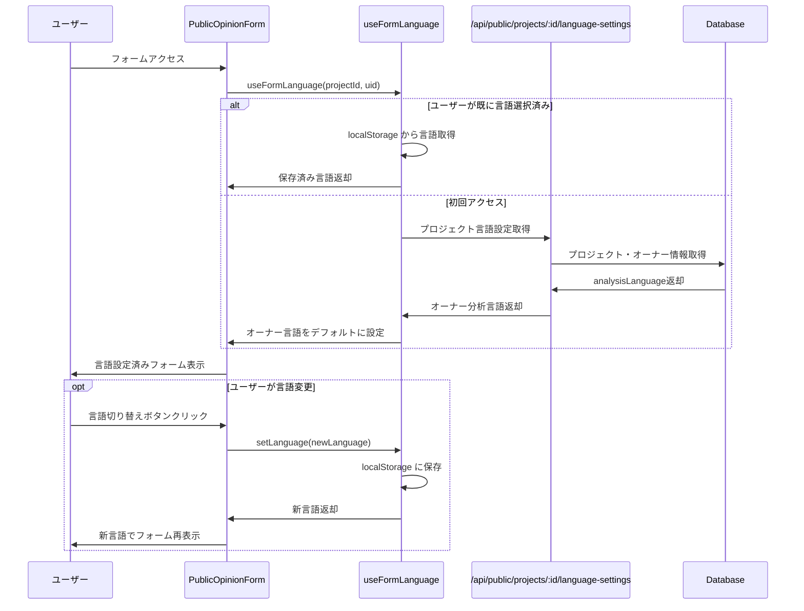

# 意見フォーム言語設定のAI分析言語連動 実装計画

## 📋 概要

意見フォーム（PublicOpinionForm）の言語切り替えのデフォルト言語を、プロジェクトオーナーのAI分析出力結果言語設定（`analysisLanguage`）に連動させる機能を実装する。

## 🔍 現状分析（詳細調査結果）

### 1. 意見フォームの現在の実装

#### **ファイル構成**:
- **メインコンポーネント**: `/client/src/components/PublicOpinionForm.tsx`
- **言語管理Hook**: `/client/src/hooks/useFormLanguage.ts`
- **翻訳ファイル**: `/client/src/translations/pages/publicOpinionForm.ts`

#### **現在の言語選択ロジック**:
```typescript
// useFormLanguage.ts の現在の実装
const [language, setLanguageState] = useState<Language>(() => {
  // 1. 意見フォーム専用のlocalStorageをチェック
  const savedFormLanguage = localStorage.getItem('consensusai_form_language') as Language;
  
  // 2. ブラウザ言語をチェック
  const browserLanguage = navigator.language.startsWith('ja') ? 'ja' : 'en';
  
  // 3. 優先順位：保存された設定 → ブラウザ言語 → デフォルト（日本語）
  const selectedLanguage = savedFormLanguage || browserLanguage || 'ja';
  
  return selectedLanguage;
});
```

#### **言語保存キー**: `consensusai_form_language` (localStorage)

### 2. プロジェクトデータ取得の現在の実装

#### **API エンドポイント**:
- **メイン**: `/api/db/projects/:id` (認証必須)
- **フォールバック**: Firebase Realtime Database

#### **データ取得フロー**:
```typescript
// PublicOpinionForm.tsx の現在の実装
try {
  // 1. Firebaseからプロジェクトデータを取得
  const db = getDatabase(app);
  const projectRef = ref(db, `users/${uid}/projects/${projectId}`);
  const snapshot = await get(projectRef);
  
  if (snapshot.exists()) {
    const data = snapshot.val();
    setProjectData({
      name: data.name || t("project.nameNotSet"),
      description: data.description || "",
      isActive: data.status !== "paused",
    });
    return;
  }
  
  // 2. Firebaseにデータがない場合、SQLite APIから取得を試行
  const apiResponse = await fetch(`/api/db/projects/${projectId}`, {
    method: "GET",
    headers: {
      "Content-Type": "application/json",
      "X-User-ID": uid,
    },
  });
} catch (error) {
  // エラーハンドリング
}
```

### 3. バックエンドAPI の現在の実装

#### **プロジェクト取得API**: `/server/src/routes/projects.db.ts`

```typescript
// router.get('/:id', ...) の実装
router.get('/:id', async (req: AuthenticatedRequest, res, next) => {
  try {
    const project = await projectService.getProject(req.params.id, req.userId!);
    res.json(project);
  } catch (error) {
    next(error);
  }
});
```

**課題**: 現在は認証必須（`requireAuth` middleware）だが、PublicOpinionFormは公開フォームのため認証なしでアクセス可能である必要がある。

#### **ProjectService の getProject メソッド**:
```typescript
// /server/src/services/projectService.db.ts
async getProject(id: string, userId: string): Promise<Project> {
  const prismaProject = await prisma.project.findFirst({
    where: { id, userId },
    include: {
      opinions: true,
      tasks: true,
      topics: { include: { opinions: true } },
      insights: true,
    },
  });
  // ... 処理続行
}
```

**課題**: 現在はプロジェクト情報のみを返しており、プロジェクトオーナーの `analysisLanguage` 設定は含まれていない。

### 4. AI分析言語設定の現在の実装

#### **データベース設計**:
- **フィールド**: `User.analysisLanguage` (ja|en|null)
- **保存場所**: SQLite Database + Firebase Realtime Database (両方同期)

#### **設定方法**:
- ダッシュボードの `AnalysisLanguageModal` で設定
- プロジェクト詳細画面の言語設定ボタンで変更

## 🎯 実装要件

### 機能要件
1. **デフォルト言語設定**: 意見フォーム初回アクセス時、プロジェクトオーナーの `analysisLanguage` をデフォルト言語として設定
2. **フォールバック処理**: `analysisLanguage` が未設定の場合、現在のロジック（ブラウザ言語 → 日本語）を維持
3. **ユーザー選択保持**: ユーザーが手動で言語を変更した場合は、その選択を保持
4. **既存機能保護**: 現在の言語切り替え機能に一切影響を与えない

### 非機能要件
1. **認証不要**: 公開フォームとして引き続き認証なしでアクセス可能
2. **パフォーマンス**: プロジェクトデータ取得時の追加API呼び出しを最小限に抑制
3. **セキュリティ**: プロジェクトオーナーの個人情報（analysisLanguage以外）を公開しない
4. **互換性**: 既存のLocalStorage保存形式との完全互換性

## 🛠️ 技術設計

### アプローチ1: 新規公開APIエンドポイント（推奨）

#### **新規エンドポイント**: `GET /api/public/projects/:id/language-settings`

**利点**:
- 既存APIに影響なし
- セキュリティ制御が容易
- 必要最小限の情報のみ公開

**実装内容**:
```typescript
// /server/src/routes/public.ts (新規作成)
router.get('/projects/:id/language-settings', async (req, res, next) => {
  try {
    const projectId = req.params.id;
    
    // プロジェクト存在確認 + オーナー情報取得
    const project = await prisma.project.findUnique({
      where: { id: projectId },
      include: {
        user: {
          select: {
            analysisLanguage: true,
            language: true
          }
        }
      }
    });
    
    if (!project) {
      return res.status(404).json({ error: 'Project not found' });
    }
    
    // プロジェクトが一時停止中の場合も考慮
    const isActive = project.status !== 'paused';
    
    // オーナーの分析言語設定を取得（フォールバック付き）
    const ownerAnalysisLanguage = project.user.analysisLanguage || project.user.language || 'ja';
    
    res.json({
      projectId: project.id,
      projectName: project.name,
      isActive,
      ownerAnalysisLanguage,
      availableLanguages: ['ja', 'en']
    });
  } catch (error) {
    next(error);
  }
});
```

### アプローチ2: 既存エンドポイント拡張（非推奨）

既存の `/api/db/projects/:id` エンドポイントを公開アクセス可能にする案は、セキュリティリスクが高いため非推奨。

## 📱 フロントエンド実装設計

### 1. useFormLanguage Hook の拡張

```typescript
// /client/src/hooks/useFormLanguage.ts の修正版
interface FormLanguageHook {
  language: Language;
  setLanguage: (lang: Language) => void;
  t: (path: string) => string;
  isLoadingProjectLanguage: boolean; // 新規追加
}

export function useFormLanguage(projectId?: string, uid?: string): FormLanguageHook {
  const [language, setLanguageState] = useState<Language>('ja'); // 初期値は仮設定
  const [isLoadingProjectLanguage, setIsLoadingProjectLanguage] = useState(false);
  
  // プロジェクト言語設定の取得
  useEffect(() => {
    const fetchProjectLanguageSettings = async () => {
      if (!projectId || !uid) {
        // プロジェクト情報がない場合は従来のロジック
        const savedFormLanguage = localStorage.getItem('consensusai_form_language') as Language;
        const browserLanguage = navigator.language.startsWith('ja') ? 'ja' : 'en';
        const selectedLanguage = savedFormLanguage || browserLanguage || 'ja';
        setLanguageState(selectedLanguage);
        return;
      }
      
      // ユーザーが既に言語を選択している場合は、その選択を優先
      const savedFormLanguage = localStorage.getItem('consensusai_form_language') as Language;
      if (savedFormLanguage) {
        setLanguageState(savedFormLanguage);
        return;
      }
      
      // プロジェクトオーナーの分析言語設定を取得
      setIsLoadingProjectLanguage(true);
      try {
        const response = await fetch(`/api/public/projects/${projectId}/language-settings`);
        if (response.ok) {
          const data = await response.json();
          const ownerLanguage = data.ownerAnalysisLanguage || 'ja';
          setLanguageState(ownerLanguage);
        } else {
          // API呼び出し失敗時は従来のフォールバック
          const browserLanguage = navigator.language.startsWith('ja') ? 'ja' : 'en';
          setLanguageState(browserLanguage || 'ja');
        }
      } catch (error) {
        console.error('Failed to fetch project language settings:', error);
        // エラー時は従来のフォールバック
        const browserLanguage = navigator.language.startsWith('ja') ? 'ja' : 'en';
        setLanguageState(browserLanguage || 'ja');
      } finally {
        setIsLoadingProjectLanguage(false);
      }
    };
    
    fetchProjectLanguageSettings();
  }, [projectId, uid]);
  
  // 以下既存の実装...
}
```

### 2. PublicOpinionForm の修正

```typescript
// /client/src/components/PublicOpinionForm.tsx の修正
export function PublicOpinionForm() {
  const { uid, projectId } = useParams<{ uid: string; projectId: string }>();
  const { language, setLanguage, t, isLoadingProjectLanguage } = useFormLanguage(projectId, uid);
  
  // 既存の実装...
  
  // 言語ローディング中のUI表示制御
  if (isLoadingProjectLanguage) {
    return (
      <div className="min-h-screen bg-gray-50 flex items-center justify-center">
        <div className="animate-spin rounded-full h-8 w-8 border-b-2 border-blue-600"></div>
      </div>
    );
  }
  
  // 既存のコンポーネント実装...
}
```

## 🔒 セキュリティ考慮事項

### 公開情報の制限
- **公開対象**: プロジェクト名、アクティブ状態、オーナーの分析言語設定のみ
- **非公開**: プロジェクト詳細情報、オーナーの個人情報、意見データ等

### レート制限
```typescript
// レート制限の実装例
import rateLimit from 'express-rate-limit';

const publicApiLimiter = rateLimit({
  windowMs: 15 * 60 * 1000, // 15分
  max: 100, // 同一IPから最大100リクエスト
  message: 'Too many requests from this IP'
});

router.use('/public', publicApiLimiter);
```

### プロジェクト存在チェック
```typescript
// プロジェクトが一時停止・削除されている場合の対応
if (!project || project.isArchived) {
  return res.status(404).json({ 
    error: 'Project not found or unavailable' 
  });
}
```

## 📋 実装手順

### Phase 1: バックエンドAPI実装
1. **新規ルートファイル作成**: `/server/src/routes/public.ts`
2. **言語設定取得エンドポイント実装**: `GET /api/public/projects/:id/language-settings`
3. **index.ts でのルート登録**: `app.use('/api/public', publicRouter)`
4. **レート制限・セキュリティ対策実装**

### Phase 2: フロントエンド実装
1. **useFormLanguage Hook 拡張**: プロジェクト言語設定取得ロジック追加
2. **PublicOpinionForm 修正**: 新しいHook利用、ローディング状態対応
3. **エラーハンドリング強化**: API呼び出し失敗時のフォールバック処理

### Phase 3: テスト・検証
1. **既存機能テスト**: 現在の言語切り替え機能が正常動作することを確認
2. **新機能テスト**: プロジェクトオーナーのanalysisLanguageに連動することを確認
3. **フォールバックテスト**: analysisLanguage未設定時の動作確認
4. **セキュリティテスト**: 公開APIの情報漏洩がないことを確認

### Phase 4: データクリーンアップ・最終確認
1. **テストデータ除去**: 動作確認で作成したテストデータの完全削除
2. **最終動作確認**: 全機能の統合テスト
3. **パフォーマンス確認**: API応答時間・フロントエンド読み込み速度測定

## 🔄 データフロー図



## ⚠️ リスク分析と対策

### 高リスク要因
1. **既存機能への影響**
   - **対策**: 新規API追加のみ、既存コードは最小限の修正
   - **検証**: 全既存機能の非回帰テスト実施

2. **公開APIのセキュリティリスク**
   - **対策**: 必要最小限の情報のみ公開、レート制限実装
   - **検証**: セキュリティ監査、ペネトレーションテスト

### 中リスク要因
1. **パフォーマンス影響**
   - **対策**: 軽量API設計、適切なキャッシュ実装
   - **検証**: 負荷テスト、レスポンス時間測定

2. **フォールバック処理の複雑化**
   - **対策**: シンプルなフォールバックチェーン実装
   - **検証**: 各フォールバックシナリオのテスト

## 📊 完了定義

### 実装完了の条件
1. **デフォルト言語連動**: プロジェクトオーナーのanalysisLanguageがフォームのデフォルト言語として設定される
2. **フォールバック動作**: analysisLanguage未設定時、現在のロジック（ブラウザ言語→日本語）が動作する
3. **ユーザー選択保持**: ユーザーが手動で言語変更した場合、その選択がlocalStorageに保存・優先される
4. **既存機能保護**: 現在の言語切り替え機能が全て正常動作する
5. **セキュリティ確保**: 公開APIで不要な情報が漏洩しない
6. **パフォーマンス維持**: フォーム表示速度に大きな影響を与えない

### テストケース
1. **新規ユーザー（localStorage無し）**: 
   - analysisLanguage設定済みオーナー → オーナー言語がデフォルト
   - analysisLanguage未設定オーナー → ブラウザ言語がデフォルト
2. **既存ユーザー（localStorage有り）**: 保存済み言語が優先される
3. **API呼び出し失敗**: 従来のフォールバック処理が動作する
4. **言語切り替え**: 手動変更後もlocalStorageに正しく保存される
5. **セキュリティ**: 公開APIで取得可能な情報が適切に制限される

---

**⚠️ 重要事項**
- 既存の意見フォーム機能に一切影響を与えないことを最優先とする
- 公開APIのセキュリティを十分に考慮し、必要最小限の情報のみ公開する
- 実装前に必ず既存機能の動作確認を実施する
- 各ステップ完了後に既存機能の非回帰テストを実施する