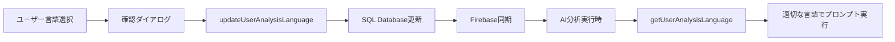

# SQLite & Firebase データ構造分析資料

**作成日**: 2025-07-28  
**最終更新日**: 2025-07-29  
**目的**: SQLiteとFirebase Realtime Databaseの同期状況とデータ構造の詳細分析  
**対象範囲**: アカウント関連データモデル（User、Contact、UserFeedbackLog）+ プロジェクト関連データモデル（Project、Opinion、Topic、Task、Insight）+ AI分析関連データモデル（AnalysisHistory、OpinionAnalysisState、OpinionStanceAnalysis、AnalysisUsage、ActionLog、analysis_checkpoints）+ **AI分析多言語対応**（User.analysisLanguage）

## 📊 概要

ConsensusAIシステムでは、データの永続化とリアルタイム機能のために **SQLite Database（メイン）** と **Firebase Realtime Database（同期・リアルタイム）** のハイブリッド構成を採用している。

### 基本方針
- **SQLite**: メインデータストレージ（CRUD操作の信頼できる情報源）
- **Firebase**: リアルタイム同期・分析進捗・通知用
- **同期順序**: SQLite → Firebase（SQLite優先、Firebase失敗時は警告継続）

---

## 🔍 1. User（ユーザー）モデル分析

### 1.1 SQLite構造 (`users` テーブル)

```sql
-- Prisma Schema より
model User {
  id                  String          @id                 -- Firebase UID
  email               String          @unique             -- メールアドレス
  name                String?                             -- 表示名（nullable）
  purpose             String?                             -- 利用目的（nullable）
  createdAt           DateTime        @default(now())     -- 作成日時
  updatedAt           DateTime        @updatedAt          -- 更新日時
  language            String?         @default("ja")      -- 言語設定
  analysisLanguage    String?                             -- AI分析言語設定（フォールバック: language）
  purposeSkipped      Boolean?        @default(false)    -- 目的設定スキップ
  avatar              String?                             -- アバターURL
  trialStartDate      DateTime?                           -- トライアル開始日
  trialEndDate        DateTime?                           -- トライアル終了日
  subscriptionStatus  String?         @default("free")    -- サブスクリプション状態
  stripeCustomerId    String?                             -- Stripe顧客ID
  isDeleted           Boolean         @default(false)     -- 削除フラグ
  deletionRequestedAt DateTime?                           -- 削除要求日時
  scheduledDeletionAt DateTime?                           -- 削除予定日時
  deletionReason      String?                             -- 削除理由
  deletionCancelledAt DateTime?                           -- 削除キャンセル日時
  
  -- リレーション
  analysisUsage       AnalysisUsage[] @relation("AnalysisUsages")
  projects            Project[]
  contacts            Contact[]       -- お問い合わせとの関連
  
  -- インデックス
  @@index([trialEndDate], map: "idx_users_trial_end_date")
  @@index([subscriptionStatus], map: "idx_users_subscription_status")
  @@index([isDeleted], map: "idx_users_is_deleted")
  @@index([scheduledDeletionAt], map: "idx_users_scheduled_deletion")
  @@map("users")
}
```

### 1.2 Firebase構造 (`/users/{userId}`)

```json
{
  "users": {
    "{userId}": {
      "id": "string",                    // ユーザーID（Firebase UID）
      "email": "string",                 // メールアドレス
      "name": "string",                  // 表示名（存在する場合）
      "purpose": "string",               // 利用目的（存在する場合）
      "language": "string",              // 言語設定（存在する場合）
      "analysisLanguage": "string",      // AI分析言語設定（存在する場合）
      "purposeSkipped": "boolean",       // 目的設定スキップ（存在する場合）
      "avatar": "string",                // アバターURL（存在する場合）
      "subscriptionStatus": "string",    // サブスクリプション状態（存在する場合）
      "trialStartDate": "ISO string",    // トライアル開始日（存在する場合）
      "trialEndDate": "ISO string",      // トライアル終了日（存在する場合）
      "createdAt": "ISO string",
      "updatedAt": "ISO string",
      
      // プロジェクト関連データ（ネストされた構造）
      "projects": {
        "{projectId}": {
          "name": "string",
          "description": "string",
          "status": "string",
          // ... プロジェクト詳細データ
          
          "opinions": {
            "{opinionId}": {
              "content": "string",
              "sentiment": "string",
              // ... 意見詳細データ
            }
          },
          
          "topics": {
            "{topicId}": {
              "name": "string",
              "summary": "string",
              // ... トピック詳細データ
            }
          }
        }
      }
    }
  }
}
```

### 1.3 同期実装分析 (`/server/src/routes/users.ts`)

**同期パターン**: 条件付きフィールド同期
```typescript
// Firebase用データ準備（undefined/null値は除外）
const firebaseUserData = {
  id,
  email: user.email,
  createdAt: user.createdAt.toISOString(),
  updatedAt: user.updatedAt.toISOString(),
  // 条件付きフィールド（存在する場合のみ同期）
  ...(user.name && { name: user.name }),
  ...(user.purpose && { purpose: user.purpose }),
  ...(user.language && { language: user.language }),
  ...(user.analysisLanguage && { analysisLanguage: user.analysisLanguage }),
  ...(user.avatar && { avatar: user.avatar }),
  ...(user.subscriptionStatus && { subscriptionStatus: user.subscriptionStatus }),
  ...(user.trialStartDate && { trialStartDate: user.trialStartDate.toISOString() }),
  ...(user.trialEndDate && { trialEndDate: user.trialEndDate.toISOString() })
};

const userRef = database.ref(`users/${id}`);
await userRef.set(firebaseUserData);
```

**同期タイミング**: 
- ユーザー作成時
- ユーザー情報更新時  
- トライアルステータス更新時（trialService経由）

---

## 🔍 2. Contact（お問い合わせ）モデル分析

### 2.1 SQLite構造 (`contacts` テーブル)

```sql
-- Prisma Schema より
model Contact {
  id          String   @id @default(cuid())    -- お問い合わせID
  userId      String?                          -- ユーザーID（認証済みユーザーの場合、nullable）
  name        String                           -- 名前
  email       String                           -- メールアドレス
  category    String                           -- カテゴリ ('technical'|'billing'|'feature'|'other')
  subject     String                           -- 件名
  message     String                           -- メッセージ内容
  status      String   @default("open")        -- ステータス ('open'|'in_progress'|'resolved')
  priority    String   @default("normal")      -- 優先度 ('low'|'normal'|'high'|'urgent')
  
  -- メタデータ
  userAgent   String?                          -- ユーザーエージェント
  browserInfo String?                          -- ブラウザ情報（JSON文字列）
  userPlan    String?                          -- ユーザープラン（自動取得）
  projectCount Int?                            -- プロジェクト数（自動取得）
  
  -- Firebase同期フィールド
  firebaseId  String?                          -- Firebase保存ID
  syncStatus  String?  @default("pending")     -- 同期状況 ('pending'|'synced'|'error')
  lastSyncAt  DateTime?                        -- 最終同期日時
  
  createdAt   DateTime @default(now())         -- 作成日時
  updatedAt   DateTime @updatedAt              -- 更新日時
  
  -- リレーション
  user        User?    @relation(fields: [userId], references: [id])
  
  -- インデックス
  @@index([userId, createdAt])
  @@index([category, status])
  @@index([status, priority])
  @@map("contacts")
}
```

### 2.2 Firebase構造 (`/contacts/{contactId}`)

```json
{
  "contacts": {
    "{contactId}": {
      "id": "string",                    // お問い合わせID
      "userId": "string|null",           // ユーザーID（未認証の場合はnull）
      "name": "string",                  // 名前
      "email": "string",                 // メールアドレス
      "category": "string",              // カテゴリ
      "subject": "string",               // 件名
      "message": "string",               // メッセージ内容
      "status": "string",                // ステータス
      "priority": "string",              // 優先度
      "userPlan": "string",              // ユーザープラン（存在する場合）
      "projectCount": "number",          // プロジェクト数（存在する場合）
      "createdAt": "ISO string",         // 作成日時
      "updatedAt": "ISO string"          // 更新日時
    }
  }
}
```

### 2.3 同期実装分析 (`/server/src/routes/contact.ts`)

**同期パターン**: undefined/null値フィルタリング
```typescript
// Firebaseに送信するデータを準備（undefined/null値をフィルタリング）
const firebaseData: Record<string, any> = {
  id: contact.id,
  name: contact.name,
  email: contact.email,
  category: contact.category,
  subject: contact.subject,
  message: contact.message,
  status: contact.status,
  priority: contact.priority,
  createdAt: contact.createdAt.toISOString(),
  updatedAt: contact.updatedAt.toISOString()
};

// null/undefined値のフィールドを除去
if (contact.userId !== null && contact.userId !== undefined) {
  firebaseData.userId = contact.userId;
}
if (contact.userPlan !== null && contact.userPlan !== undefined) {
  firebaseData.userPlan = contact.userPlan;
}
if (contact.projectCount !== null && contact.projectCount !== undefined) {
  firebaseData.projectCount = contact.projectCount;
}

const contactRef = database.ref(`contacts/${contact.id}`);
await contactRef.set(firebaseData);
```

**特徴**:
- **認証・未認証ユーザー両対応**: userIdがnullの場合も正常処理
- **独立階層**: Firebaseでは `/contacts` ルート階層に保存（`/users/{userId}/contacts` ではない）
- **管理者専用**: Admin SDK経由でのみアクセス可能

---

## 🔍 3. UserFeedbackLog（ユーザーフィードバック）モデル分析

### 3.1 SQLite構造 (`user_feedback_logs` テーブル)

```sql
-- Prisma Schema より
model UserFeedbackLog {
  id             String   @id @default(cuid())     -- フィードバックID
  userHashId     String                            -- ハッシュ化ユーザーID（匿名化）
  feedbackType   String   @default("account_deletion") -- フィードバック種別
  deletionReason String?                           -- 削除理由
  customReason   String?                           -- カスタム理由
  userContext    String?                           -- ユーザーコンテキスト（JSON文字列）
  createdAt      DateTime @default(now())          -- 作成日時

  @@index([feedbackType, createdAt])
  @@map("user_feedback_logs")
}
```

### 3.2 Firebase構造 (`/user_feedback_log/{feedbackId}`)

```json
{
  "user_feedback_log": {
    "{feedbackId}": {
      "id": "string",                    // フィードバックID
      "userHashId": "string",            // ハッシュ化ユーザーID
      "feedbackType": "account_deletion", // フィードバック種別
      "deletionReason": "string",        // 削除理由（存在する場合）
      "customReason": "string",          // カスタム理由（存在する場合）
      "userContext": "JSON string",      // ユーザーコンテキスト
      "createdAt": "ISO string",         // 作成日時
      
      // 開発者通知データ（サブコレクション）
      "developer_notification": {
        "id": "string",                  // 通知ID
        "type": "user_feedback",         // 通知タイプ
        "deletionReason": "string",      // 削除理由（存在する場合）
        "customReason": "string",        // カスタム理由（存在する場合）
        "userContext": {                 // クリーンアップされたユーザーコンテキスト
          "accountAge": "string",
          "projectRange": "string",
          "purpose": "string"            // 存在する場合のみ
        },
        "timestamp": "ISO string",       // 通知タイムスタンプ
        "priority": "string",            // 通知優先度
        "read": false                    // 読み取り状況
      }
    }
  }
}
```

### 3.3 同期実装分析 (`/server/src/services/userFeedbackService.ts`)

**同期パターン**: undefined値除去 + 開発者通知統合
```typescript
// Firebase用データ準備（undefined/null値を除去）
const firebaseData: Record<string, any> = {
  id: feedbackLog.id,
  userHashId,
  feedbackType: 'account_deletion',
  deletionReason,
  userContext: JSON.stringify(userContext),
  createdAt: feedbackLog.createdAt.toISOString()
};

// customReasonがundefined/nullでない場合のみ追加
if (customReason !== null && customReason !== undefined) {
  firebaseData.customReason = customReason;
}

const feedbackRef = adminDatabase!.ref(`user_feedback_log/${feedbackLog.id}`);
await feedbackRef.set(firebaseData);
```

**開発者通知同期** (`/server/src/services/developerNotificationService.ts`):
```typescript
// Firebase用データ準備（undefined/null値を除去）
const notificationData: Record<string, any> = {
  id: feedbackData.id,
  type: 'user_feedback',
  timestamp: feedbackData.createdAt.toISOString(),
  priority: this.determineNotificationPriority(feedbackData),
  read: false
};

// undefined/null値を除去してFirebaseエラーを防ぐ
if (feedbackData.deletionReason !== null && feedbackData.deletionReason !== undefined) {
  notificationData.deletionReason = feedbackData.deletionReason;
}
// ... 他フィールドも同様

const firebasePath = `user_feedback_log/${feedbackData.id}/developer_notification`;
await adminDatabase.ref(firebasePath).set(notificationData);
```

---

## 📋 4. データ同期状況まとめ

### 4.1 同期実装状況

| モデル | SQLite保存 | Firebase同期 | 同期方式 | undefined値対応 |
|--------|------------|--------------|----------|-----------------|
| **User** | ✅ 完全実装 | ✅ 実装済み | 条件付きフィールド | ✅ 対応済み |
| **Contact** | ✅ 完全実装 | ✅ 実装済み | フィルタリング | ✅ 対応済み |
| **UserFeedbackLog** | ✅ 完全実装 | ✅ 実装済み | フィルタリング + 通知 | ✅ 対応済み |

### 4.2 Firebase Database Rules 対応状況

```json
{
  "rules": {
    // ✅ 実装済み・最適化済み
    "user_feedback_log": {
      "$feedbackId": {
        ".read": true,
        ".write": true
      }
    },
    
    // ✅ 既存実装
    "users": {
      "$uid": {
        "projects": { /* ... */ },
        // ユーザー基本情報フィールド
        ".read": true,
        ".write": true
      }
    },
    
    // ✅ 新規追加・最適化済み
    "contacts": {
      "$contactId": {
        ".read": true,
        ".write": true,
        ".validate": "/* 包括的バリデーション */"
      }
    }
  }
}
```

### 4.3 同期エラー対応状況

| エラータイプ | 対応方法 | 影響度 |
|--------------|----------|--------|
| **undefined値エラー** | フィルタリング実装済み | ✅ 解決済み |
| **権限エラー** | Admin SDK + Rules最適化 | ✅ 解決済み |
| **Firebase接続エラー** | ベストエフォート継続 | ⚠️ 警告レベル |

---

## 🔧 5. 推奨改善点

### 5.1 即座対応項目
- [ ] Contact の Firebase 同期テスト実行
- [ ] UserFeedbackLog の undefined値エラー完全解決確認

### 5.2 将来的改善項目
- [ ] Firebase Rules のバリデーション強化
- [ ] 同期失敗時の自動リトライ機能
- [ ] データ整合性チェック機能
- [ ] 管理画面でのデータ同期状況表示

---

---

## 🔍 4. Project（プロジェクト）モデル分析

### 4.1 SQLite構造 (`projects` テーブル)

```sql
-- Prisma Schema より
model Project {
  id                        String                 @id @default(cuid())
  name                      String                              -- プロジェクト名
  description               String?                             -- プロジェクト説明
  status                    String                 @default("collecting") -- ステータス
  collectionMethod          String                              -- 収集方法
  createdAt                 DateTime               @default(now())
  updatedAt                 DateTime               @updatedAt
  opinionsCount             Int                    @default(0)  -- 意見数（動的計算）
  isCompleted               Boolean                @default(false)
  completedAt               DateTime?
  isArchived                Boolean                @default(false)
  archivedAt                DateTime?
  priorityLevel             String?                             -- 優先度
  priorityReason            String?                             -- 優先度理由
  priorityUpdatedAt         DateTime?
  slackChannel              String?                             -- Slack連携
  webformUrl                String?                             -- Webフォーム URL
  isAnalyzed                Boolean                @default(false)
  lastAnalysisAt            DateTime?                           -- 最終分析日時
  lastAnalyzedOpinionsCount Int?                               -- 最終分析時の意見数
  analyzedOpinionsCount     Int                    @default(0)
  pendingOpinionsCount      Int                    @default(0)
  
  -- Firebase同期フィールド
  firebaseId                String?                             -- Firebase ID
  syncStatus                String?                @default("pending")
  lastSyncAt                DateTime?
  
  userId                    String                              -- オーナーユーザー
  
  -- リレーション
  analysis_checkpoints      analysis_checkpoints[]
  analysisHistory           AnalysisHistory[]
  analysisUsage             AnalysisUsage[]        @relation("AnalysisUsages")
  insights                  Insight[]
  opinions                  Opinion[]
  user                      User                   @relation(fields: [userId], references: [id], onDelete: Cascade)
  tasks                     Task[]
  topics                    Topic[]
  
  @@map("projects")
}
```

### 4.2 Firebase構造 (`/users/{userId}/projects/{projectId}`)

```json
{
  "users": {
    "{userId}": {
      "projects": {
        "{projectId}": {
          "id": "string",                     // SQLite ID
          "firebaseId": "string",             // Firebase ID (クロスリファレンス)
          "name": "string",                   // プロジェクト名
          "description": "string",            // プロジェクト説明（存在する場合）
          "status": "collecting|in-progress|completed", // ステータス（正規化済み）
          "collectionMethod": "string",       // 収集方法
          "createdAt": "ISO string",          // 作成日時
          "updatedAt": "ISO string",          // 更新日時
          "isCompleted": "boolean",           // 完了フラグ
          "completedAt": "ISO string",        // 完了日時（存在する場合）
          "isArchived": "boolean",            // アーカイブフラグ
          "archivedAt": "ISO string",         // アーカイブ日時（存在する場合）
          "priorityLevel": "string",          // 優先度（存在する場合）
          "priorityReason": "string",         // 優先度理由（存在する場合）
          "slackChannel": "string",           // Slack連携（存在する場合）
          "webformUrl": "string",             // WebフォームURL（存在する場合）
          "isAnalyzed": "boolean",            // 分析済みフラグ
          "lastAnalysisAt": "ISO string",     // 最終分析日時（存在する場合）
          
          // 子データ（ネストされた構造）
          "opinions": {
            "{opinionId}": {
              "content": "string",
              "sentiment": "string",
              "submittedAt": "ISO string",
              "isBookmarked": "boolean",
              "characterCount": "number",
              // ... 詳細データ
            }
          },
          
          "tasks": {
            "{taskId}": {
              "title": "string",
              "description": "string",
              "status": "string",
              "dueDate": "ISO string",
              // ... 詳細データ
            }
          },
          
          "topics": {
            "{topicId}": {
              "name": "string",
              "category": "string",
              "summary": "string",
              "count": "number",
              "status": "string",
              // ... 詳細データ
            }
          },
          
          "analysis": {
            "topics": { /* 分析結果のトピック */ },
            "insights": { /* 分析インサイト */ },
            "analysisHistory": { /* 分析履歴 */ },
            "summary": { /* 集計データ */ }
          }
        }
      }
    }
  }
}
```

### 4.3 同期実装分析 (`/server/src/services/projectService.db.ts`)

**同期パターン**: 原子的トランザクション + 双方向ID管理
```typescript
// 1. SQLite操作優先（CLAUDE.md準拠）
const project = await prisma.project.create({ data });

// 2. Firebase同期（エラー時は完全ロールバック）
try {
  const firebaseData = {
    id: project.id,
    name: project.name,
    description: project.description,
    status: normalizeStatus(project.status), // ステータス正規化
    collectionMethod: project.collectionMethod,
    createdAt: project.createdAt.toISOString(),
    updatedAt: project.updatedAt.toISOString(),
    isCompleted: project.isCompleted,
    isArchived: project.isArchived
    // 条件付きフィールド（存在する場合のみ）
    ...(project.completedAt && { completedAt: project.completedAt.toISOString() }),
    ...(project.priorityLevel && { priorityLevel: project.priorityLevel })
  };
  
  await syncToFirebase(userId, firebaseProjectId, firebaseData, 'create');
} catch (firebaseError) {
  // Firebase失敗時：SQLite完全ロールバック
  await prisma.project.delete({ where: { id: project.id } });
  throw new AppError('FIREBASE_SYNC_FAILED', firebaseError.message);
}
```

**特徴**:
- **双方向ID管理**: SQLite ID ⇔ Firebase ID の相互参照
- **ステータス正規化**: SQLite形式 → Firebase形式の変換
- **完全ロールバック**: Firebase失敗時はSQLite操作も取り消し
- **動的計算**: `opinionsCount` は同期せず、動的に計算

---

## 🔍 5. Opinion（意見）モデル分析

### 5.1 SQLite構造 (`opinions` テーブル)

```sql
-- Prisma Schema より（主要フィールドのみ）
model Opinion {
  id                    String                  @id @default(cuid())
  content               String                                      -- 意見内容
  submittedAt           DateTime                @default(now())     -- 投稿日時
  isBookmarked          Boolean                 @default(false)     -- ブックマーク
  sentiment             String                  @default("NEUTRAL") -- 感情分析
  characterCount        Int                                         -- 文字数
  projectId             String                                      -- プロジェクトID
  topicId               String?                                     -- トピックID
  
  -- Firebase同期フィールド
  firebaseId            String?
  lastSyncAt            DateTime?
  syncStatus            String?                 @default("pending")
  
  -- 分析関連
  metadata              String?                                     -- メタデータ（JSON）
  analysisStatus        String                  @default("unanalyzed")
  analyzedAt            DateTime?
  analysisVersion       Int?
  
  -- アクション管理
  actionLogs            String?                                     -- アクションログ（JSON）
  actionStatus          String?                 @default("unhandled")
  dueDate               DateTime?
  priorityLevel         String?
  priorityReason        String?
  priorityUpdatedAt     DateTime?
  actionStatusReason    String?
  actionStatusUpdatedAt DateTime?
  
  -- リレーション
  newActionLogs         ActionLog[]             @relation("OpinionActionLogs")
  analysisState         OpinionAnalysisState?
  stanceAnalyses        OpinionStanceAnalysis[]
  topic                 Topic?                  @relation(fields: [topicId], references: [id])
  project               Project                 @relation(fields: [projectId], references: [id], onDelete: Cascade)
  
  @@index([projectId, analysisStatus])
  @@index([projectId, analyzedAt])
  @@map("opinions")
}
```

### 5.2 Firebase構造 (ネストされた意見データ)

```json
{
  "users": {
    "{userId}": {
      "projects": {
        "{projectId}": {
          "opinions": {
            "{opinionId}": {
              "id": "string",                    // 意見ID
              "content": "string",               // 意見内容
              "submittedAt": "ISO string",       // 投稿日時
              "isBookmarked": "boolean",          // ブックマーク状態
              "sentiment": "NEUTRAL|POSITIVE|NEGATIVE", // 感情分析結果
              "characterCount": "number",        // 文字数
              "topicId": "string",               // 関連トピックID（存在する場合）
              "analysisStatus": "unanalyzed|analyzed|processing", // 分析ステータス
              "analyzedAt": "ISO string",        // 分析日時（存在する場合）
              "actionStatus": "unhandled|handled|pending", // アクション状態
              "priorityLevel": "string",         // 優先度（存在する場合）
              "dueDate": "ISO string",           // 期限（存在する場合）
              "metadata": { /* 分析メタデータ */ }  // 分析結果詳細（存在する場合）
            }
          }
        }
      }
    }
  }
}
```

### 5.3 同期実装分析 (`/server/src/services/opinionService.db.ts`)

**同期パターン**: プロジェクトネスト型同期
```typescript
// Firebase同期用データ準備
const firebaseOpinionData = {
  id: opinion.id,
  content: opinion.content,
  submittedAt: opinion.submittedAt.toISOString(),
  isBookmarked: opinion.isBookmarked,
  sentiment: opinion.sentiment,
  characterCount: opinion.characterCount,
  analysisStatus: opinion.analysisStatus,
  actionStatus: opinion.actionStatus,
  // 条件付きフィールド
  ...(opinion.topicId && { topicId: opinion.topicId }),
  ...(opinion.analyzedAt && { analyzedAt: opinion.analyzedAt.toISOString() }),
  ...(opinion.priorityLevel && { priorityLevel: opinion.priorityLevel }),
  ...(opinion.dueDate && { dueDate: opinion.dueDate.toISOString() }),
  ...(opinion.metadata && { metadata: JSON.parse(opinion.metadata) })
};

// プロジェクト配下にネストして保存
const opinionPath = `users/${userId}/projects/${firebaseProjectId}/opinions/${opinion.id}`;
await database.ref(opinionPath).set(firebaseOpinionData);
```

---

## 🔍 6. Topic（トピック）・Task（タスク）モデル分析

### 6.1 Topic モデル同期実装

**SQLite**: `topics` テーブル（15フィールド + Firebase同期フィールド）
**Firebase**: `/users/{userId}/projects/{projectId}/topics/{topicId}`
**同期方式**: プロジェクトネスト型、完全同期

### 6.2 Task モデル同期実装  

**SQLite**: `tasks` テーブル（8フィールド + Firebase同期フィールド）
**Firebase**: `/users/{userId}/projects/{projectId}/tasks/{taskId}`
**同期方式**: プロジェクトネスト型、完全同期

### 6.3 分析結果特殊同期 (`/server/src/services/analysisResultsSyncService.ts`)

**分析データ専用構造**:
```json
{
  "users": {
    "{userId}": {
      "projects": {
        "{projectId}": {
          "analysis": {
            "topics": { /* AI分析で生成されたトピック */ },
            "insights": { /* 分析インサイト */ },
            "analysisHistory": { /* 実行履歴 */ },
            "summary": {
              "topicsCount": "number",
              "totalOpinions": "number",
              "lastAnalysisAt": "ISO string"
            }
          }
        }
      }
    }
  }
}
```

---

## 📋 7. プロジェクト関連データ同期状況まとめ

### 7.1 同期実装状況

| モデル | SQLite保存 | Firebase同期 | 同期方式 | ロールバック対応 | 動的計算フィールド |
|--------|------------|--------------|----------|------------------|-------------------|
| **Project** | ✅ 完全実装 | ✅ 双方向同期 | 原子的トランザクション | ✅ 完全対応 | opinionsCount |
| **Opinion** | ✅ 完全実装 | ✅ ネスト同期 | プロジェクト配下 | ✅ 完全対応 | - |
| **Topic** | ✅ 完全実装 | ✅ ネスト同期 | プロジェクト配下 | ✅ 完全対応 | - |
| **Task** | ✅ 完全実装 | ✅ ネスト同期 | プロジェクト配下 | ✅ 完全対応 | - |
| **Insight** | ✅ 完全実装 | ✅ 分析同期 | 分析結果経由 | ✅ 完全対応 | - |
| **AnalysisHistory** | ✅ 完全実装 | ✅ 分析同期 | 分析結果経由 | ✅ 完全対応 | - |

### 7.2 Firebase Database Rules プロジェクト対応状況

```json
{
  "rules": {
    "users": {
      "$uid": {
        "projects": {
          "$projectId": {
            // ✅ 完全実装済み - プロジェクト基本データ
            ".read": "auth != null && auth.uid == $uid",
            ".write": "auth != null && auth.uid == $uid",
            
            "opinions": {
              // ✅ 意見データの読み書き権限
              "$opinionId": {
                ".read": "auth != null && auth.uid == $uid",
                ".write": "auth != null && auth.uid == $uid"
              }
            },
            
            "tasks": {
              // ✅ タスクデータの読み書き権限
              "$taskId": {
                ".read": "auth != null && auth.uid == $uid",
                ".write": "auth != null && auth.uid == $uid"
              }
            },
            
            "topics": {
              // ✅ トピックデータの読み書き権限
              "$topicId": {
                ".read": "auth != null && auth.uid == $uid",
                ".write": "auth != null && auth.uid == $uid"
              }
            },
            
            "analysis": {
              // ✅ 分析結果の読み書き権限
              ".read": "auth != null && auth.uid == $uid",
              ".write": "auth != null && auth.uid == $uid"
            }
          }
        }
      }
    }
  }
}
```

---

## 📋 8. 課金分析システム（BillingAnalytics）⚠️ **2025-07-28 新規追加**

### 8.1 新規実装サービス

**ファイル**: `/server/src/services/billingAnalyticsService.ts` ⚠️ **2025-07-28新規作成**

#### 8.1.1 主要機能

| 機能 | APIエンドポイント | 実装詳細 |
|------|------------------|----------|
| **トライアル統計** | `GET /api/admin/trial-stats` | 総数・ステータス別・期間別統計 |
| **課金レポート** | `GET /api/admin/billing-report` | ユーザー分布・収益推定・期間指定 |
| **リテンション分析** | `GET /api/admin/retention-analysis` | コンバージョン率・チャーン率・週別リテンション |

#### 8.1.2 管理者API統合

**ファイル**: `/server/src/routes/admin.ts` ⚠️ **2025-07-28更新**

- 開発者限定アクセス（`requireDeveloperAuth`）
- 包括的なエラーハンドリング
- 詳細なアクセスログ記録

### 8.2 分析データソース

| データソース | 利用目的 | 分析内容 |
|-------------|----------|----------|
| **User** | ユーザー分布分析 | Free/Trial/Pro/Cancelled比率・トライアル開始数 |
| **組み合わせ分析** | 総合ビジネス指標 | 収益推定・ユーザー分布 |

---

### 7.3 プロジェクト特有の同期機能

| 機能 | 実装状況 | 詳細 |
|------|----------|------|
| **双方向ID管理** | ✅ 実装済み | SQLite ⇔ Firebase ID相互参照 |
| **ステータス正規化** | ✅ 実装済み | SQLite形式 → Firebase形式変換 |
| **動的計算** | ✅ 実装済み | opinionsCount等は同期せず計算 |
| **バッチ分析同期** | ✅ 実装済み | 分析結果の一括同期機能 |
| **エラー回復** | ✅ 実装済み | 完全ロールバック + リトライ |
| **開発モード** | ✅ 実装済み | `FIREBASE_DISABLE_SYNC` 対応 |

---

## 🔍 8. AnalysisHistory（分析履歴）モデル分析

### 8.1 SQLite構造 (`analysis_history` テーブル)

```sql
-- Prisma Schema より
model AnalysisHistory {
  id                   String    @id @default(cuid())     -- 分析履歴ID
  projectId            String                            -- プロジェクトID
  analysisType         String                            -- 分析タイプ
  opinionsProcessed    Int                               -- 処理された意見数
  newTopicsCreated     Int       @default(0)            -- 新規作成トピック数
  updatedTopics        Int       @default(0)            -- 更新トピック数
  executionTimeSeconds Int?                             -- 実行時間（秒）
  createdAt            DateTime  @default(now())        -- 作成日時
  
  -- Firebase同期フィールド
  firebaseId           String?                           -- Firebase ID
  syncStatus           String?   @default("pending")     -- 同期状況
  lastSyncAt           DateTime?                         -- 最終同期日時
  
  -- 実行メタデータ
  executedBy           String?                           -- 実行者
  executionReason      String?                           -- 実行理由
  
  -- リレーション
  project              Project   @relation(fields: [projectId], references: [id], onDelete: Cascade)
  
  @@map("analysis_history")
}
```

### 8.2 Firebase構造 (`/users/{userId}/projects/{projectId}/analysis/analysisHistory/{historyId}`)

```json
{
  "users": {
    "{userId}": {
      "projects": {
        "{projectId}": {
          "analysis": {
            "analysisHistory": {
              "{historyId}": {
                "id": "string",                    // 分析履歴ID
                "projectId": "string",             // プロジェクトID
                "analysisType": "string",          // 分析タイプ
                "opinionsProcessed": "number",     // 処理意見数
                "newTopicsCreated": "number",      // 新規トピック数
                "updatedTopics": "number",         // 更新トピック数
                "executionTimeSeconds": "number",  // 実行時間
                "createdAt": "ISO string",         // 作成日時
                "executedBy": "system|user_id",    // 実行者（デフォルト: system）
                "executionReason": "auto|manual",  // 実行理由（デフォルト: auto）
                "lastSyncAt": "ISO string"         // 最終同期日時
              }
            },
            
            "summary": {
              "totalAnalyses": "number",          // 総分析回数
              "lastAnalysisAt": "ISO string",     // 最終分析日時
              "totalOpinionsProcessed": "number"  // 総処理意見数
            }
          }
        }
      }
    }
  }
}
```

### 8.3 同期実装分析 (`/server/src/services/analysisResultsSyncService.ts`)

**同期パターン**: 分析結果統合同期
```typescript
// 分析履歴データのFirebase同期（lines 228-265相当）
const analysisHistoryData = analysisHistories.map(history => {
  // デフォルト値適用
  const executedBy = history.executedBy || 'system';
  const executionReason = history.executionReason || 'auto';
  
  return {
    id: history.id,
    projectId: history.projectId,
    analysisType: history.analysisType,
    opinionsProcessed: history.opinionsProcessed,
    newTopicsCreated: history.newTopicsCreated || 0,
    updatedTopics: history.updatedTopics || 0,
    executionTimeSeconds: history.executionTimeSeconds || 0,
    createdAt: history.createdAt.toISOString(),
    executedBy: executedBy,
    executionReason: executionReason,
    lastSyncAt: new Date().toISOString()
  };
});

// Firebase分析結果エリアに統合保存
const analysisPath = `users/${userId}/projects/${firebaseProjectId}/analysis`;
await database.ref(analysisPath).update({
  analysisHistory: analysisHistoryData.reduce((acc, item) => {
    acc[item.id] = item;
    return acc;
  }, {}),
  summary: {
    totalAnalyses: analysisHistoryData.length,
    lastAnalysisAt: analysisHistoryData[0]?.createdAt,
    totalOpinionsProcessed: analysisHistoryData.reduce((sum, h) => sum + h.opinionsProcessed, 0)
  }
});
```

**特徴**:
- **統合同期**: 分析結果全体として一括同期（analysisResultsSyncService経由）
- **デフォルト値処理**: executedBy, executionReason の未設定値を自動補完
- **集計データ生成**: Firebase側で分析統計サマリーを自動生成
- **原子的トランザクション**: Firebase失敗時はSQLite操作もロールバック

---

## 🔍 9. OpinionAnalysisState（意見分析状態）モデル分析

### 9.1 SQLite構造 (`opinion_analysis_state` テーブル)

```sql
-- Prisma Schema より
model OpinionAnalysisState {
  opinionId                String    @id                 -- 意見ID（主キー）
  projectId                String                        -- プロジェクトID
  lastAnalyzedAt           DateTime?                     -- 最終分析日時
  analysisVersion          Int       @default(1)        -- 分析バージョン
  topicId                  String?                       -- 関連トピックID
  classificationConfidence Decimal?                      -- 分類信頼度
  manualReviewFlag         Boolean   @default(false)    -- 手動レビューフラグ
  createdAt                DateTime  @default(now())    -- 作成日時
  updatedAt                DateTime  @updatedAt         -- 更新日時
  
  -- Firebase同期フィールド
  firebaseId               String?                       -- Firebase ID
  syncStatus               String?   @default("pending") -- 同期状況
  lastSyncAt               DateTime?                     -- 最終同期日時
  
  -- リレーション
  opinion                  Opinion   @relation(fields: [opinionId], references: [id], onDelete: Cascade)
  
  @@index([projectId, lastAnalyzedAt])
  @@index([projectId, syncStatus])
  @@map("opinion_analysis_state")
}
```

### 9.2 Firebase構造（将来実装予定）

```json
{
  "users": {
    "{userId}": {
      "projects": {
        "{projectId}": {
          "opinions": {
            "{opinionId}": {
              "analysisState": {
                "lastAnalyzedAt": "ISO string",       // 最終分析日時
                "analysisVersion": "number",          // 分析バージョン
                "topicId": "string",                  // 関連トピックID（存在する場合）
                "classificationConfidence": "number", // 分類信頼度（存在する場合）
                "manualReviewFlag": "boolean",        // 手動レビューフラグ
                "updatedAt": "ISO string"             // 更新日時
              }
            }
          }
        }
      }
    }
  }
}
```

### 9.3 同期実装分析

**同期状況**: **現在未実装（将来対応予定）**
- **SQLiteフィールド**: Firebase同期用フィールドは定義済み
- **同期実装**: まだ実装されていない（スキーマのみ準備済み）
- **用途**: 意見レベルの分析状態管理・進捗トラッキング用

---

## 🔍 10. OpinionStanceAnalysis（意見スタンス分析）モデル分析

### 10.1 SQLite構造 (`opinion_stance_analysis` テーブル)

```sql
-- Prisma Schema より
model OpinionStanceAnalysis {
  id               String    @id @default(cuid())     -- スタンス分析ID
  opinionId        String                            -- 意見ID
  topicId          String                            -- トピックID
  stance           String                            -- スタンス（agree/disagree/neutral/conditional）
  confidence       Decimal   @default(0.0)          -- 信頼度
  reasoning        String?                           -- 判定理由
  analyzedAt       DateTime  @default(now())        -- 分析日時
  createdAt        DateTime  @default(now())        -- 作成日時
  updatedAt        DateTime  @updatedAt             -- 更新日時
  
  -- Firebase同期フィールド
  firebaseId       String?                           -- Firebase ID
  syncStatus       String?   @default("pending")     -- 同期状況
  lastSyncAt       DateTime?                         -- 最終同期日時
  
  -- 詳細分析フィールド
  detailedStance   String?                           -- 詳細スタンス
  sentiment        String?                           -- 感情分析
  constructiveness String?                           -- 建設性
  emotionalTone    String?                           -- 感情トーン
  
  -- リレーション
  topic            Topic     @relation(fields: [topicId], references: [id], onDelete: Cascade)
  opinion          Opinion   @relation(fields: [opinionId], references: [id], onDelete: Cascade)
  
  @@unique([opinionId, topicId])
  @@index([topicId, stance])
  @@index([opinionId, analyzedAt])
  @@index([topicId, detailedStance])
  @@map("opinion_stance_analysis")
}
```

### 10.2 Firebase構造（計画段階）

```json
{
  "users": {
    "{userId}": {
      "projects": {
        "{projectId}": {
          "topics": {
            "{topicId}": {
              "stanceAnalysis": {
                "{opinionId}": {
                  "id": "string",                    // スタンス分析ID
                  "stance": "agree|disagree|neutral|conditional", // スタンス
                  "confidence": "number",            // 信頼度（0.0-1.0）
                  "reasoning": "string",             // 判定理由（存在する場合）
                  "analyzedAt": "ISO string",        // 分析日時
                  "detailedStance": "string",        // 詳細スタンス（存在する場合）
                  "sentiment": "string",             // 感情分析（存在する場合）
                  "constructiveness": "string",      // 建設性（存在する場合）
                  "emotionalTone": "string"          // 感情トーン（存在する場合）
                }
              }
            }
          }
        }
      }
    }
  }
}
```

### 10.3 同期実装分析 (`/server/src/services/opinionStanceAnalysisService.ts`)

**同期状況**: **プレースホルダー実装（次フェーズ対応予定）**
```typescript
// lines 477-507相当の実装
private static async syncStanceAnalysisToFirebase(
  stanceAnalysis: any, 
  userId: string, 
  firebaseProjectId: string
): Promise<void> {
  try {
    // TODO: 次フェーズでFirebase同期を実装
    console.log('[OpinionStanceAnalysisService] 🔧 Firebase同期は次フェーズで実装予定');
    
    // プレースホルダー: スタンス分析データのFirebase同期
    // const stancePath = `users/${userId}/projects/${firebaseProjectId}/topics/${stanceAnalysis.topicId}/stanceAnalysis/${stanceAnalysis.opinionId}`;
    // await database.ref(stancePath).set(firebaseStanceData);
    
  } catch (error) {
    console.error('[OpinionStanceAnalysisService] ❌ Firebase同期エラー（プレースホルダー）:', error);
    // Firebase同期失敗は非クリティカル（SQLite操作は継続）
  }
}
```

---

## 🔍 11. その他AI分析関連モデル分析

### 11.1 AnalysisUsage（分析使用量）モデル

**SQLite構造**: `analysis_usage` テーブル（11フィールド）
**Firebase同期**: **同期フィールドなし**
**用途**: ユーザー別・プロジェクト別の分析使用量追跡（内部管理用）
**設計判断**: 使用量データはSQLite専用が適切（プライバシー・管理効率）

### 11.2 ActionLog（アクションログ）モデル

**SQLite構造**: `action_logs` テーブル（10フィールド）
**Firebase同期**: **同期フィールドなし**
**用途**: 意見に対するアクション履歴管理（内部トラッキング用）
**設計判断**: 大容量ログデータはSQLite専用が適切（パフォーマンス重視）

### 11.3 analysis_checkpoints（分析チェックポイント）モデル

**SQLite構造**: `analysis_checkpoints` テーブル（8フィールド）
**Firebase同期**: **同期フィールドなし**
**用途**: 分析処理の中間状態保存（将来実装予定機能）
**設計判断**: チェックポイントデータはSQLite専用が適切（処理効率）
**現在の状態**: **テーブル定義済み・未使用（将来対応準備済み）**

---

## 📋 12. AI分析関連データ同期状況まとめ

### 12.1 同期実装状況

| モデル | SQLite保存 | Firebase同期 | 同期方式 | 実装状況 | 将来対応 |
|--------|------------|--------------|----------|----------|----------|
| **AnalysisHistory** | ✅ 完全実装 | ✅ 統合同期済み | 分析結果統合 | ✅ 完全実装 | - |
| **OpinionAnalysisState** | ✅ 完全実装 | ⚠️ 同期フィールドのみ | 意見別状態管理 | 📋 将来実装 | ✅ 予定 |
| **OpinionStanceAnalysis** | ✅ 完全実装 | ⚠️ プレースホルダー | トピック別スタンス | 📋 次フェーズ | ✅ 予定 |
| **AnalysisUsage** | ✅ 完全実装 | ❌ 同期対象外 | - | ❌ 対象外 | ❌ 不要 |
| **ActionLog** | ✅ 完全実装 | ❌ 同期対象外 | - | ❌ 対象外 | ❌ 不要 |
| **analysis_checkpoints** | ✅ 定義済み・未使用 | ❌ 同期対象外 | - | 📋 将来機能 | 📋 検討中 |

### 12.2 AI分析Firebase構造概要

```json
{
  "users": {
    "{userId}": {
      "projects": {
        "{projectId}": {
          "analysis": {
            "analysisHistory": { /* ✅ 実装済み */ },
            "summary": { /* ✅ 実装済み */ },
            "topics": { /* 既存トピック同期 */ },
            "insights": { /* 既存インサイト同期 */ }
          },
          "opinions": {
            "{opinionId}": {
              "analysisState": { /* 📋 将来実装 */ }
            }
          },
          "topics": {
            "{topicId}": {
              "stanceAnalysis": { /* 📋 次フェーズ */ }
            }
          }
        }
      }
    }
  }
}
```

### 12.3 AI分析特有の同期特徴

| 特徴 | 実装状況 | 詳細 |
|------|----------|------|
| **統合分析結果同期** | ✅ 実装済み | analysisResultsSyncService経由の一括同期 |
| **分析進捗リアルタイム追跡** | ✅ 実装済み | Firebase listeners経由のリアルタイム更新 |
| **分析バージョン管理** | 📋 準備済み | OpinionAnalysisStateで将来対応予定 |
| **スタンス分析詳細追跡** | 📋 計画段階 | OpinionStanceAnalysisで次フェーズ対応 |
| **チェックポイント管理** | 📋 未実装 | 将来の大規模分析対応で検討中 |
| **使用量・ログ管理** | ✅ SQLite専用 | 内部管理のためFirebase同期対象外 |

---

## 🔍 13. アカウント削除システム分析

### 13.1 アカウント削除アーキテクチャ概要

**削除方式**: **段階的ソフト削除**（30日間猶予期間付き）
```
削除要求 → ソフト削除（30日猶予） → 物理削除
       ↘ キャンセル可能
```

**主要サービス**:
- `AccountDeletionService` - メイン削除処理
- `UserFeedbackService` - 匿名化フィードバック記録
- `ScheduledDeletionService` - 自動物理削除（毎日3:00 JST）

### 13.2 削除プロセス段階別分析

#### 段階1: 削除要求 (`POST /:id/deletion-request`)

**Userモデルフィールド更新**:
```typescript
{
  isDeleted: true,                    // 削除フラグ
  deletionRequestedAt: new Date(),    // 削除要求日時
  scheduledDeletionAt: new Date() + 30日, // 物理削除予定日時
  deletionReason: reason,             // 削除理由
  updatedAt: new Date()               // 更新日時
}
```

**実行順序**:
1. **Stripe連携**: アクティブなサブスクリプション自動キャンセル
2. **SQLite更新**: 削除フィールド更新
3. **Firebase同期**: 削除状態をFirebaseに同期
4. **フィードバック記録**: `user_feedback_log`に匿名化データ保存
5. **ロールバック**: Firebase同期失敗時はSQLite変更も取り消し

#### 段階2: 削除キャンセル (`DELETE /:id/deletion-request`)

**Userモデルフィールド更新**:
```typescript
{
  isDeleted: false,                   // 削除フラグ解除
  deletionCancelledAt: new Date(),    // キャンセル日時
  updatedAt: new Date(),              // 更新日時
  // クリア対象フィールド
  deletionRequestedAt: null,
  scheduledDeletionAt: null,
  deletionReason: null
}
```

**追加処理**:
- **フィードバックログ削除**: `UserFeedbackService.deleteDeletionFeedback()`
- **Firebase同期**: 削除解除状態をFirebaseに同期

#### 段階3: 物理削除 (`executeAccountDeletion`)

**完全データ削除順序**:
1. **Firebase Realtime Database** - ユーザーデータ完全削除
2. **SQLite Database** - ユーザー削除（CASCADE で関連データも削除）
3. **Firebase Authentication** - アカウント削除

**削除対象データ**:
- ユーザー基本情報、プロジェクト、意見、分析データ等全て
- **保持データ**: `user_feedback_log`の匿名化フィードバックのみ

### 13.3 UserFeedbackLogモデル詳細分析

#### 用途と目的

**✅ ユーザー認識正解**: **開発者向け管理画面での退会理由分析用**

**具体的用途**:
1. **プロダクト改善分析**: 匿名化された退会理由データ
2. **チャーン分析**: なぜユーザーが離脱するかのパターン把握
3. **開発者インサイト**: アカウント期間・プロジェクト利用パターン
4. **トレンド分析**: 時系列での退会傾向分析

#### データ匿名化仕様

**匿名化処理** (`UserFeedbackService.generateUserHash()`):
```typescript
// SHA256ハッシュ化でユーザーID匿名化
const salt = process.env.FEEDBACK_HASH_SALT || 'consensus_ai_feedback_salt_2024';
const userHashId = crypto
  .createHash('sha256')
  .update(userId + salt)
  .digest('hex');
```

**匿名化コンテキスト例**:
```json
{
  "accountAge": "1-4_weeks",           // カテゴリ化されたアカウント期間
  "projectRange": "2-5",               // カテゴリ化されたプロジェクト数
  "purpose": "business",               // 利用目的（カテゴリ）
  "language": "ja",                   // 言語設定
  "lastActivity": "within_week"        // カテゴリ化された最終活動
}
```

**匿名化保証**:
- **個人特定不可**: ハッシュ化により元のユーザーIDは復元不可
- **PII除外**: 名前、メールアドレス等の個人情報は一切保存しない
- **行動パターンのみ**: 数値データはカテゴリ化して個人特定を防止

### 13.4 開発者向け分析機能

#### 管理画面API

**統計取得**: `GET /api/admin/feedback-stats`
```json
{
  "reasonStats": [
    { "reason": "lack_of_time", "count": 15, "percentage": 35 },
    { "reason": "found_alternative", "count": 8, "percentage": 19 }
  ],
  "contextStats": {
    "accountAge": { "less_than_week": 5, "1-4_weeks": 10 },
    "projectRange": { "none": 3, "single": 8, "2-5": 7 }
  },
  "insights": [
    "新規ユーザー（1週間未満）の退会が5件（23%）発生しています。",
    "複数プロジェクトを利用していたユーザーの退会が7件（32%）発生しています。"
  ]
}
```

**トレンド分析**: `GET /api/admin/feedback-trends`
- 日別退会数統計
- 理由別トレンド推移
- コンテキスト別傾向分析
- 自動生成インサイト

**最新フィードバック**: `GET /api/admin/feedback-recent`
- 最新の退会フィードバック一覧
- ページネーション対応
- 匿名化データのみ表示

#### 開発者通知システム

**Firebase通知**: `user_feedback_log/{feedbackId}/developer_notification`
```json
{
  "id": "feedback_id",
  "type": "user_feedback",
  "deletionReason": "lack_of_time",
  "customReason": "仕事が忙しくなった",
  "userContext": {
    "accountAge": "1-4_weeks",
    "projectRange": "2-5",
    "purpose": "business"
  },
  "timestamp": "2025-07-28T12:00:00Z",
  "priority": "medium",                // 新規ユーザーは "high"
  "read": false
}
```

**Slack通知**: 環境変数 `SLACK_WEBHOOK_URL` 設定時
- 退会フィードバックのSlack通知
- 優先度別メッセージ
- 匿名化されたユーザーコンテキスト表示

### 13.5 データ整合性とGDPR対応

#### GDPR準拠設計

**個人データ完全削除**: 物理削除時に全個人情報削除
**匿名化データ保持**: 統計・改善目的の匿名化データのみ保持
**削除権利対応**: 30日猶予期間でのキャンセル可能
**データ最小化**: 必要最小限の匿名化データのみ保存

#### データベース同期保証

**原子的トランザクション**: SQLite→Firebase順序での同期
```typescript
// 削除要求処理での同期パターン
try {
  // 1. SQLite更新
  const updatedUser = await prisma.user.update(...);
  
  // 2. Firebase同期
  await syncUserToFirebase(updatedUser);
  
  // 3. フィードバック記録
  await UserFeedbackService.logDeletionFeedback(...);
  
} catch (firebaseError) {
  // Firebase失敗時は全てロールバック
  await prisma.user.update({ /* 元の状態に復元 */ });
  throw new Error('削除要求処理に失敗しました');
}
```

**データ一貫性保証**: Firebase同期失敗時は全操作をロールバック

---

---

## 🔍 14. 課金・サブスクリプションシステム分析

### 14.1 課金システムアーキテクチャ概要

**サブスクリプション管理方式**: **Stripe連携 + User管理**
```
Freeプラン → トライアル開始 → Proプラン
          ↘ 期限切れ → Freeプランに復帰
```

**主要コンポーネント**:
- `StripeService` - Stripe SDK統合・Webhook処理
- `TrialService` - トライアル管理・Firebase同期
- `PlanLimitService` - プラン別アクセス制御
- `PlanDetailsService` - プラン詳細情報管理

### 14.2 User モデル課金関連フィールド分析

#### 課金フィールドのFirebase同期状況

```typescript
// Userモデル課金関連フィールド（schema.prisma より）
model User {
  trialStartDate      DateTime?              // トライアル開始日
  trialEndDate        DateTime?              // トライアル終了日  
  subscriptionStatus  String? @default("free") // サブスクリプション状態
  stripeCustomerId    String?                // Stripe顧客ID
  // ... 他のフィールド
}
```

#### Firebase同期実装 (`/server/src/services/trialService.ts`)

**同期パターン**: **Best Effort同期**（Firebase失敗でもSQL操作は継続）
```typescript
private static async syncToFirebase(user: User): Promise<void> {
  try {
    const userRef = database.ref(`users/${user.id}`);
    await userRef.update({
      subscriptionStatus: user.subscriptionStatus,
      trialStartDate: user.trialStartDate?.toISOString() || null,
      trialEndDate: user.trialEndDate?.toISOString() || null,
      updatedAt: user.updatedAt.toISOString()
    });
  } catch (error) {
    // Firebase失敗は警告レベル（SQL操作は継続）
    console.warn('[TrialService] Firebase同期失敗（非クリティカル）:', error);
  }
}
```

**同期対象フィールド**:
- ✅ `subscriptionStatus` - サブスクリプション状態
- ✅ `trialStartDate` - トライアル開始日（ISO文字列）
- ✅ `trialEndDate` - トライアル終了日（ISO文字列）
- ❌ `stripeCustomerId` - **意図的に除外**（セキュリティ上の機密情報）

### 14.3 Stripe連携システム分析

#### API構成

**Billing API** (`/server/src/routes/billing.ts`):
- `POST /create-checkout-session` - Stripeチェックアウト作成
- `POST /webhook` - Stripeウェブフック処理（署名検証付き）
- `GET /subscription-status/:userId` - サブスクリプション状態取得
- `POST /cancel-subscription` - サブスクリプションキャンセル
- `GET /subscription-info/:userId` - 詳細サブスクリプション情報
- `GET /history/:userId` - Stripeからの課金履歴取得
- `GET /health` - Stripe接続ヘルスチェック

**Trial API** (`/server/src/routes/trial.ts`):
- `GET /status` - 現在のトライアル状態
- `GET /remaining-days` - トライアル残日数
- `POST /extend` - トライアル期間延長（管理者専用）
- `POST /start` - Freeプランユーザーのトライアル開始
- `POST /upgrade` - サブスクリプションアップグレード処理
- `GET /health` - トライアルサービスヘルスチェック

#### Stripeウェブフック処理

**処理対象イベント**:
- `checkout.session.completed` - チェックアウト完了
- `customer.subscription.created/updated/deleted` - サブスクリプション管理
- `invoice.payment_succeeded/failed` - 請求処理
- `customer.subscription.trial_will_end` - トライアル期限警告

**データフロー**:
```
Stripeイベント → StripeService.handleWebhook() → TrialService.updateSubscriptionStatus() → SQL + Firebase同期
```

### 14.4 サブスクリプションライフサイクル管理

#### プラン遷移フロー

```
1. Freeユーザー → POST /api/trial/start → Trialユーザー
2. Trialユーザー → 自動期限チェック → Freeユーザー（期限切れ）
3. Trialユーザー → Stripeチェックアウト → Proユーザー
```

#### プラン制限設定 (`/server/src/config/limits.ts`)

**環境変数設定**:
- `TRIAL_DURATION_DAYS` (デフォルト: 14日)
- `FREE_PLAN_MAX_PROJECTS` (デフォルト: 1個)
- `TRIAL_PLAN_MAX_PROJECTS` (デフォルト: 5個) 
- `PRO_PLAN_*` (無制限: -1)

#### アクセス制御統合

**PlanLimitService連携**:
- 全API エンドポイントでプラン別制限を動的チェック
- トライアル期限切れの自動検知・プラン降格
- Stripe統合による正確なサブスクリプション状態取得

### 14.5 UserPlanHistory（ユーザープラン履歴）モデル分析

#### 14.5.1 SQLite構造 (`user_plan_history` テーブル)

```sql
-- Prisma Schema より
model UserPlanHistory {
  id            String   @id @default(cuid())     -- 履歴レコードID
  userId        String                            -- ユーザーID（外部キー）
  fromPlan      String?                           -- 変更前プラン（初回設定時はnull）
  toPlan        String                            -- 変更後プラン
  changeType    String                            -- 変更種別（upgrade/downgrade/cancel/trial_start/trial_end/restore/initial）
  changeReason  String?                           -- 変更理由（任意）
  stripeEventId String?                           -- Stripe イベントID（Stripe経由の変更の場合）
  metadata      String?                           -- 追加メタデータ（JSON文字列）
  effectiveDate DateTime                          -- 変更実施日時
  createdAt     DateTime @default(now())          -- レコード作成日時
  firebaseId    String?                           -- Firebase同期用ID
  syncStatus    String?  @default("pending")     -- 同期状況（pending/synced/failed）
  lastSyncAt    DateTime?                         -- 最終同期日時
  
  -- リレーション
  user          User     @relation(fields: [userId], references: [id], onDelete: Cascade)
  
  -- インデックス（パフォーマンス最適化）
  @@index([userId, effectiveDate])           -- ユーザー別履歴取得用
  @@index([changeType, createdAt])           -- 変更種別別統計用
  @@index([userId, changeType])              -- ユーザー別変更種別検索用
  @@map("user_plan_history")
}
```

#### 14.5.2 Firebase構造 (`/users/{userId}/planHistory/{historyId}`)

```json
{
  "users": {
    "{userId}": {
      "planHistory": {
        "{historyId}": {
          "id": "string",                    // 履歴レコードID
          "fromPlan": "string",              // 変更前プラン（存在する場合）
          "toPlan": "string",                // 変更後プラン
          "changeType": "string",            // 変更種別
          "changeReason": "string",          // 変更理由（存在する場合）
          "stripeEventId": "string",         // Stripe イベントID（存在する場合）
          "metadata": "JSON string",         // 追加メタデータ（存在する場合）
          "effectiveDate": "ISO string",     // 変更実施日時
          "createdAt": "ISO string"          // レコード作成日時
        }
      }
    }
  }
}
```

#### 14.5.3 同期実装分析 (`/server/src/services/UserPlanHistoryService.ts`)

**同期パターン**: ベストエフォート同期（Firebase失敗でもSQLは継続）

```typescript
// Firebase同期（ベストエフォート）
private static async syncToFirebase(historyRecord: UserPlanHistory): Promise<void> {
  if (!isFirebaseInitialized || !database) {
    console.warn('[UserPlanHistoryService] Firebase未初期化のため同期をスキップ');
    // 同期失敗をSQLiteに記録
    await prisma.userPlanHistory.update({
      where: { id: historyRecord.id },
      data: { syncStatus: 'failed', lastSyncAt: new Date() }
    });
    return;
  }

  try {
    const firebaseData = {
      id: historyRecord.id,
      fromPlan: historyRecord.fromPlan,
      toPlan: historyRecord.toPlan,
      changeType: historyRecord.changeType,
      changeReason: historyRecord.changeReason,
      stripeEventId: historyRecord.stripeEventId,
      metadata: historyRecord.metadata,
      effectiveDate: historyRecord.effectiveDate.toISOString(),
      createdAt: historyRecord.createdAt.toISOString()
    };

    // Firebaseパス: users/{userId}/planHistory/{historyId}
    const planHistoryRef = database.ref(`users/${historyRecord.userId}/planHistory/${historyRecord.id}`);
    await planHistoryRef.set(firebaseData);

    // 書き込み確認 + 追加検証（2025-07-29追加）
    const verifySnapshot = await planHistoryRef.once('value');
    if (!verifySnapshot.exists()) {
      throw new Error('Firebase書き込み後の確認でデータが存在しません');
    }
    
    // 1秒後に再検証（データ永続化確認）
    await new Promise(resolve => setTimeout(resolve, 1000));
    const reVerifySnapshot = await planHistoryRef.once('value');
    if (!reVerifySnapshot.exists()) {
      throw new Error('Firebase書き込み後の再検証でデータが存在しません');
    }

    // 同期成功をSQLiteに記録
    await prisma.userPlanHistory.update({
      where: { id: historyRecord.id },
      data: {
        syncStatus: 'synced',
        lastSyncAt: new Date()
      }
    });
  } catch (firebaseError) {
    // Firebase同期エラーでも全体処理は成功とする（ベストエフォート）
    console.error('[UserPlanHistoryService] Firebase同期エラー:', firebaseError);
    
    // 同期失敗をSQLiteに記録
    await prisma.userPlanHistory.update({
      where: { id: historyRecord.id },
      data: {
        syncStatus: 'failed',
        lastSyncAt: new Date()
      }
    });
  }
}
```

**特徴**:
- **自動履歴記録**: TrialService・StripeServiceから自動的にプラン変更を記録
- **Firebase階層構造**: `/users/{userId}/planHistory/{historyId}` でユーザー別に整理
- **同期状態管理**: syncStatus・lastSyncAtでFirebase同期状況を追跡
- **Stripe連携**: stripeEventIdでStripe Webhook イベントとの紐付け
- **API公開**: `GET /api/users/:id/plan-history` でプラン履歴取得可能
- **重複記録防止**: trial_end + trial_expired の重複レコード作成を防止（2025-07-29追加）
- **Firebase書き込み検証**: 書き込み後の即座確認 + 1秒後再検証でデータ永続化保証（2025-07-29追加）

#### 14.5.3.1 重複記録防止システム（2025-07-29追加）

**問題**: 並行API実行によりtrial_end記録が重複作成される問題

**解決策**: 時間ベース重複チェック + 並行実行制御
```typescript
// 重複チェック（過去5分以内の同一記録を検索）
if (changeType === 'trial_end' && changeReason === 'trial_expired') {
  const existingDuplicate = await prisma.userPlanHistory.findFirst({
    where: {
      userId,
      changeType: 'trial_end',
      changeReason: 'trial_expired',
      createdAt: {
        gte: new Date(Date.now() - 5 * 60 * 1000) // 過去5分以内
      }
    }
  });
  
  if (existingDuplicate) {
    return { success: true, historyId: 'duplicate_skipped' };
  }
}
```

**追加対策** (`/server/src/services/trialService.ts`):
- **In-Memory Lock**: `processingUsers = new Set<string>()` で並行実行を制御
- **ロック機能**: 同一ユーザーの並行処理をブロック

#### 14.5.4 実装システム統合状況

**統合システム**:

| サービス | 連携内容 | 実装状況 |
|----------|----------|----------|
| **TrialService** | プラン変更時に自動記録 | ✅ 完全統合 |
| **StripeService** | Webhook経由で全プラン変更を記録 | ✅ 完全統合 |
| **Users API** | `GET /api/users/:id/plan-history` エンドポイント | ✅ 実装済み |
| **Frontend** | AccountSettings画面での履歴表示 | ✅ 実装済み |

**記録される変更種別**:
- `initial`: 初回プラン設定
- `trial_start`: トライアル開始
- `trial_end`: トライアル終了
- `upgrade`: プランアップグレード
- `downgrade`: プランダウングレード
- `cancel`: プランキャンセル
- `restore`: プラン復元

#### 14.5.5 追加修正・改善履歴（2025-07-29）

**Firebase データ消失問題の修正**:
```typescript
// 問題: users.ts で set() を使用することでplanHistoryが上書き消去される
await userRef.set(firebaseUserData);  // ❌ 上書きによりplanHistoryが消失

// 修正: update() を使用してplanHistoryを保持
await userRef.update(firebaseUserData); // ✅ 既存データを保持
```

**UI改善・絵文字除去** (`usePlanStatus.ts`):
```typescript
// すべてのプラン表示からアイコン・絵文字を除去
case PLAN_TYPES.FREE:
  planIcon = '';  // 変更前: '📋'
case PLAN_TYPES.TRIAL: 
  planIcon = '';  // 変更前: '🚀'
case PLAN_TYPES.PRO:
  planIcon = '';  // 変更前: '👑'
```

**決済フロー統一** (`Dashboard.tsx`):
- ヘッダーメニューとダッシュボードバナーの決済遷移を統一
- 両方とも同一タブでCheckout Session APIを使用
- Stripe webhook 500エラーの修正

**購入履歴重複表示修正** (`AccountSettings.tsx`):
```typescript
// 問題: プラン変更履歴と決済履歴が重複表示
const combinedHistory = [...formattedStripeHistory, ...localHistory]; // ❌

// 修正: 決済履歴のみ表示（プラン変更履歴は除外）
const combinedHistory = [...formattedStripeHistory]; // ✅
```

**トースト通知の改善** (`dashboard.ts`):
```typescript
// 変更前: 技術的すぎるメッセージ
payment: {
  success: '決済が完了しました！サブスクリプションが有効化されました。'
},

// 変更後: ユーザーフレンドリーなメッセージ
payment: {
  success: 'Proプランをご利用いただけるようになりました🎉 すべての機能をお試しください！'
},
```

### 14.6 課金データ同期状況まとめ

#### 同期実装状況

| モデル | SQLite保存 | Firebase同期 | 同期方式 | 実装状況 | 同期フィールド数 |
|--------|------------|--------------|----------|----------|------------------|
| **User（課金フィールド）** | ✅ 完全実装 | ✅ Best Effort同期 | プラン状態同期 | ✅ 完全実装 | 3フィールド |
| **UserPlanHistory** | ✅ 完全実装 | ✅ Best Effort同期 | ユーザー別階層同期 | ✅ 完全実装 | 8フィールド |

#### Firebase同期除外フィールド

**User モデル**:
```typescript
// 以下は意図的にFirebase除外（セキュリティ・機密情報）
stripeCustomerId    // Stripe顧客ID（機密情報）
```

#### 課金特有の同期特徴

| 特徴 | 実装状況 | 詳細 |
|------|----------|------|
| **Best Effort同期** | ✅ 実装済み | Firebase失敗でもSQL操作は継続 |
| **Stripe Webhook統合** | ✅ 実装済み | 署名検証付きウェブフック処理 |
| **プラン別アクセス制御** | ✅ 実装済み | 全API横断でのプラン制限適用 |
| **トライアル自動管理** | ✅ 実装済み | 期限切れ自動検知・プラン降格 |
| **課金履歴管理** | ✅ 実装済み | UserPlanHistoryモデルでの完全履歴管理 |
| **セキュリティ配慮** | ✅ 実装済み | Stripe機密情報のFirebase除外 |
| **履歴トラッキング** | ✅ 実装済み | UserPlanHistoryによる全プラン変更の自動記録 |

---

## 🔍 15. AI分析多言語対応システム分析 ⚠️ **2025-07-29 新規実装**

### 15.1 多言語対応アーキテクチャ概要

**実装背景**: プロジェクト詳細画面でユーザーがAI分析の出力言語を選択可能にする機能

**データフロー**:
```
ユーザー言語選択 → User.analysisLanguage更新 → SQL + Firebase同期 → AI分析実行時に言語指定
```

### 15.2 User.analysisLanguage フィールド詳細分析

#### 15.2.1 SQLite実装 (`users` テーブル)

```sql
-- 新規追加フィールド (Line 33)
analysisLanguage    String?     -- AI分析言語設定（フォールバック: language → 'ja'）
```

**特徴**:
- **オプショナル**: `String?` で未設定可能（初期値: null）
- **フォールバック設計**: `analysisLanguage` → `language` → `'ja'` の3段階フォールバック
- **バックワード互換**: 既存ユーザーは `language` フィールドが継続使用される

#### 15.2.2 Firebase同期実装 (`/users/{userId}`)

```json
{
  "users": {
    "{userId}": {
      "language": "ja",                    // 既存UI言語設定
      "analysisLanguage": "en",            // 新規AI分析専用言語設定（存在する場合のみ）
      // ... 他のフィールド
    }
  }
}
```

**同期パターン**: **条件付き同期**（値が存在する場合のみFirebaseに保存）
```typescript
// server/src/routes/users.ts (Line 124, 155, 211, 262)
...(user.analysisLanguage && { analysisLanguage: user.analysisLanguage }),
```

### 15.3 AI分析言語選択システム実装

#### 15.3.1 フロントエンド実装 (`AuthContext.tsx`)

**User インターフェース拡張**:
```typescript
interface User {
  language?: "ja" | "en";           // 既存UI言語
  analysisLanguage?: "ja" | "en";   // 新規AI分析言語
  // ...
}
```

**専用更新メソッド**:
```typescript
const updateUserAnalysisLanguage = async (analysisLanguage: "ja" | "en") => {
  // SQL Database + Firebase同期での更新処理（Line 347-379）
};
```

#### 15.3.2 UI実装 (`ProjectDetail.tsx`)

**言語選択UI**: AI分析セクション内に配置
```tsx
// Line 2652-2695: 分析言語設定表示・変更UI
<div className="bg-gray-50 rounded-lg p-3 mb-3 border border-gray-200">
  <div className="flex items-center justify-between mb-2">
    <Globe className="h-4 w-4 text-gray-500" />
    <span>{getCurrentAnalysisLanguageDisplay()}</span>
  </div>
  {/* ラジオボタンによる言語選択 */}
</div>
```

**確認ダイアログ**: 言語変更時のユーザー確認（Line 1598-1636）

#### 15.3.3 バックエンドAI分析統合

**TopicAnalysisService** (`topicAnalysisService.ts`):

```typescript
// 新規メソッド: ユーザー分析言語取得（Line 119-138）
private async getUserAnalysisLanguage(userId: string): Promise<string> {
  const user = await prisma.user.findUnique({
    where: { id: userId },
    select: { analysisLanguage: true, language: true }
  });
  
  // 優先順位: analysisLanguage > language > 'ja'
  return user?.analysisLanguage || user?.language || 'ja';
}
```

**AI分析実行時の言語適用** (4箇所で使用):
- Line 1178: `analyzeTopics` メインプロンプト
- Line 1342: `analyzeTopics` フォールバック処理
- Line 2000: `getProjectAnalysisResults` サマリー生成
- Line 2026: `getIncrementalSummary` 完了メッセージ

### 15.4 翻訳システム統合

#### 15.4.1 翻訳ファイル更新 (`projectDetail.ts`)

**日本語翻訳** (Line 166-179):
```typescript
analysisLanguage: {
  title: '分析結果の言語設定',
  japanese: '日本語',
  english: '英語',
  usingUserLanguage: 'ユーザー言語設定より',
  changeConfirm: {
    title: '分析言語を変更しますか？',
    message: '今後のAI分析結果が{language}で出力されます。'
  }
}
```

**英語翻訳** (Line 637-650):
```typescript
analysisLanguage: {
  title: 'Analysis Output Language',
  japanese: 'Japanese',
  english: 'English',
  // ...
}
```

### 15.5 データ同期保証システム

#### 15.5.1 完全ロールバック対応

```typescript
// server/src/routes/users.ts での同期保証
try {
  // 1. SQL Database更新
  const updatedUser = await prisma.user.update({
    data: { analysisLanguage: newValue }
  });
  
  // 2. Firebase同期
  await syncToFirebase(updatedUser);
} catch (firebaseError) {
  // Firebase失敗時：SQLをロールバック
  await prisma.user.update({
    data: { analysisLanguage: originalValue }
  });
  throw new Error('分析言語設定の更新に失敗しました');
}
```

#### 15.5.2 既存機能への影響評価

**✅ 完全バックワード互換**:
- 既存ユーザー: `analysisLanguage = null` でも従来通り動作
- 既存AI分析: `language` フィールドが継続使用される
- UI表示: フォールバック表示で既存設定を表示

### 15.6 多言語AI分析実装状況まとめ

#### 15.6.1 実装完了項目

| 機能 | 実装状況 | 詳細 |
|------|----------|------|
| **データベーススキーマ拡張** | ✅ 完了 | User.analysisLanguage フィールド追加 |
| **Firebase同期** | ✅ 完了 | 条件付き同期（値存在時のみ） |
| **フロントエンド認証統合** | ✅ 完了 | AuthContext + 専用更新メソッド |
| **UI実装** | ✅ 完了 | 言語選択UI + 確認ダイアログ |
| **AI分析統合** | ✅ 完了 | 全AI分析メソッドで言語指定対応 |
| **翻訳対応** | ✅ 完了 | 日英両言語の翻訳ファイル |
| **バックワード互換** | ✅ 完了 | 既存ユーザーへの影響なし |

#### 15.6.2 多言語AI分析データフロー



#### 15.6.3 フォールバック機能詳細

**言語解決順序**:
1. **第一優先**: `User.analysisLanguage` （専用AI分析言語設定）
2. **第二優先**: `User.language` （既存UI言語設定）
3. **最終フォールバック**: `'ja'` （システムデフォルト）

**フォールバック表示**:
- UI表示: "日本語 (ユーザー言語設定より)" のように分析言語の由来を明示
- 設定解除: `analysisLanguage = null` で `language` 設定にフォールバック可能

---

**最終更新**: 2025-07-29  
**検証環境**: 開発環境（SQLite + Firebase Realtime Database）  
**ステータス**: 全データモデル分析完了（アカウント + プロジェクト + AI分析 + アカウント削除 + 課金システム + プラン履歴 + **AI分析多言語対応**）✅